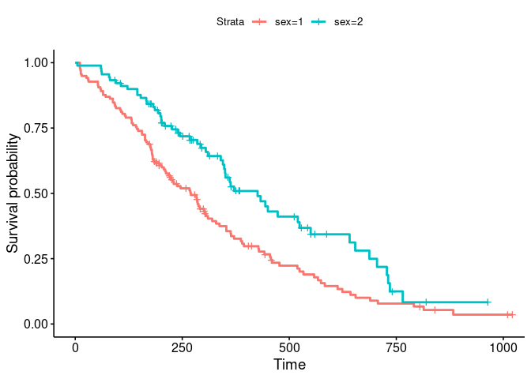
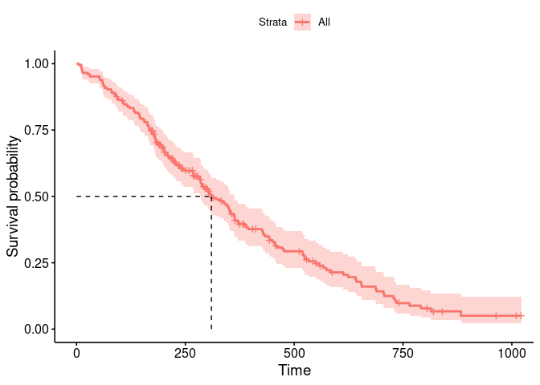

``` r
# override {reprex} default image upload to imgur!
knitr::opts_knit$set(upload.fun = identity)


library(survival)

data <- survival::lung
fit1 <- survfit(Surv(time, status) ~ sex, data = data)

# produces warning from ggplot2 3.5.0
survminer::ggsurvplot(
  fit = fit1,
  data = data,
  surv.median.line = "hv"
)
#> Warning in geom_segment(aes(x = 0, y = max(y2), xend = max(x1), yend = max(y2)), : All aesthetics have length 1, but the data has 2 rows.
#> ℹ Did you mean to use `annotate()`?
#> All aesthetics have length 1, but the data has 2 rows.
#> ℹ Did you mean to use `annotate()`?
```

<!-- -->

``` r

# works fine w/o surv.median.line
survminer::ggsurvplot(
  fit = fit1,
  data = data
)
```

<!-- -->

``` r

# works fine with only one suvival curve
fit2 <- survfit(Surv(time, status) ~ 1, data = data)

survminer::ggsurvplot(
  fit = fit2,
  data = data,
  surv.median.line = "hv"
)
```

<!-- -->

<sup>Created on 2024-02-27 with [reprex v2.1.0](https://reprex.tidyverse.org)</sup>

<details style="margin-bottom:10px;">
<summary>
Session info
</summary>

``` r
sessioninfo::session_info()
#> ─ Session info ───────────────────────────────────────────────────────────────
#>  setting  value
#>  version  R version 4.3.2 (2023-10-31)
#>  os       Ubuntu 20.04.6 LTS
#>  system   x86_64, linux-gnu
#>  ui       X11
#>  language (EN)
#>  collate  C.UTF-8
#>  ctype    C.UTF-8
#>  tz       Etc/UTC
#>  date     2024-02-27
#>  pandoc   3.1.12.1 @ /usr/bin/ (via rmarkdown)
#> 
#> ─ Packages ───────────────────────────────────────────────────────────────────
#>  package     * version date (UTC) lib source
#>  abind         1.4-5   2016-07-21 [1] RSPM
#>  backports     1.4.1   2021-12-13 [1] RSPM
#>  broom         1.0.5   2023-06-09 [1] RSPM
#>  car           3.1-2   2023-03-30 [1] RSPM
#>  carData       3.0-5   2022-01-06 [1] RSPM
#>  cli           3.6.2   2023-12-11 [1] RSPM
#>  colorspace    2.1-0   2023-01-23 [1] RSPM
#>  data.table    1.15.0  2024-01-30 [1] RSPM
#>  digest        0.6.34  2024-01-11 [1] RSPM
#>  dplyr         1.1.4   2023-11-17 [1] RSPM
#>  evaluate      0.23    2023-11-01 [1] RSPM
#>  fansi         1.0.6   2023-12-08 [1] RSPM
#>  farver        2.1.1   2022-07-06 [1] RSPM
#>  fastmap       1.1.1   2023-02-24 [1] RSPM
#>  fs            1.6.3   2023-07-20 [1] RSPM
#>  generics      0.1.3   2022-07-05 [1] RSPM
#>  ggplot2       3.5.0   2024-02-23 [1] RSPM
#>  ggpubr        0.6.0   2023-02-10 [1] RSPM
#>  ggsignif      0.6.4   2022-10-13 [1] RSPM
#>  glue          1.7.0   2024-01-09 [1] RSPM
#>  gridExtra     2.3     2017-09-09 [1] RSPM
#>  gtable        0.3.4   2023-08-21 [1] RSPM
#>  highr         0.10    2022-12-22 [1] RSPM
#>  htmltools     0.5.7   2023-11-03 [1] RSPM
#>  km.ci         0.5-6   2022-04-06 [1] RSPM
#>  KMsurv        0.1-5   2012-12-03 [1] RSPM
#>  knitr         1.45    2023-10-30 [1] RSPM
#>  labeling      0.4.3   2023-08-29 [1] RSPM
#>  lattice       0.22-5  2023-10-24 [4] CRAN (R 4.3.1)
#>  lifecycle     1.0.4   2023-11-07 [1] RSPM
#>  magrittr      2.0.3   2022-03-30 [1] RSPM
#>  Matrix        1.6-5   2024-01-11 [4] CRAN (R 4.3.2)
#>  munsell       0.5.0   2018-06-12 [1] RSPM
#>  pillar        1.9.0   2023-03-22 [1] RSPM
#>  pkgconfig     2.0.3   2019-09-22 [1] RSPM
#>  purrr         1.0.2   2023-08-10 [1] RSPM
#>  R.cache       0.16.0  2022-07-21 [1] CRAN (R 4.3.2)
#>  R.methodsS3   1.8.2   2022-06-13 [1] RSPM
#>  R.oo          1.26.0  2024-01-24 [1] RSPM
#>  R.utils       2.12.3  2023-11-18 [1] RSPM
#>  R6            2.5.1   2021-08-19 [1] RSPM
#>  reprex        2.1.0   2024-01-11 [1] RSPM
#>  rlang         1.1.3   2024-01-10 [1] RSPM
#>  rmarkdown     2.25    2023-09-18 [1] RSPM
#>  rstatix       0.7.2   2023-02-01 [1] RSPM
#>  rstudioapi    0.15.0  2023-07-07 [1] RSPM
#>  scales        1.3.0   2023-11-28 [1] RSPM
#>  sessioninfo   1.2.2   2021-12-06 [1] RSPM
#>  styler        1.10.2  2023-08-29 [1] CRAN (R 4.3.2)
#>  survival    * 3.5-7   2023-08-14 [4] CRAN (R 4.3.1)
#>  survminer     0.4.9   2021-03-09 [1] RSPM
#>  survMisc      0.5.6   2022-04-07 [1] RSPM
#>  tibble        3.2.1   2023-03-20 [1] RSPM
#>  tidyr         1.3.1   2024-01-24 [1] RSPM
#>  tidyselect    1.2.0   2022-10-10 [1] RSPM
#>  utf8          1.2.4   2023-10-22 [1] RSPM
#>  vctrs         0.6.5   2023-12-01 [1] RSPM
#>  withr         3.0.0   2024-01-16 [1] RSPM
#>  xfun          0.42    2024-02-08 [1] RSPM
#>  xtable        1.8-4   2019-04-21 [1] RSPM
#>  yaml          2.3.8   2023-12-11 [1] RSPM
#>  zoo           1.8-12  2023-04-13 [1] RSPM
#> 
#>  [1] /home/henning_lorenzen_ext/R/x86_64-pc-linux-gnu-library/4.3
#>  [2] /usr/local/lib/R/site-library
#>  [3] /usr/lib/R/site-library
#>  [4] /usr/lib/R/library
#> 
#> ──────────────────────────────────────────────────────────────────────────────
```

</details>
